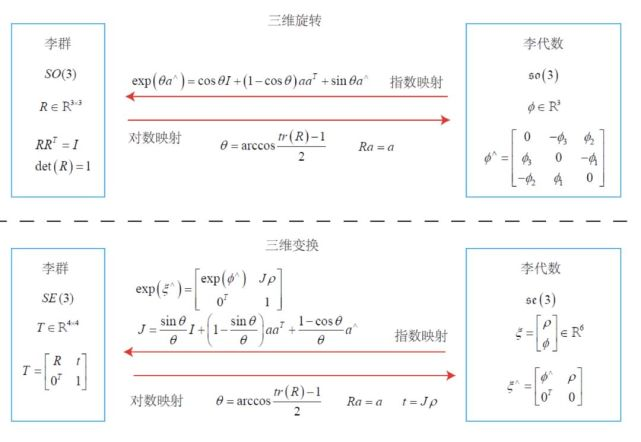

# 李群与李代数

## 为什么要引入李群李代数？

因为在SLAM中位姿是未知的，而我们需要解决形如“什么样的相机位姿最符合当前观测数据”这样的问题。一种典型的方式是把它构建成一个优化问题，求解最优的 $R$，$t$，使得误差最小。

旋转矩阵自身是带有约束的（正交且行列式为1）。它们作为优化变量时，会引入额外的约束，使优化变得困难。通过李群-李代数的转换关系，我们希望把位姿估计变成无约束的优化问题，简化求解方式。

求最优化问题，往往是一个最小二乘问题，要求目标函数J对于变换矩阵T的导数，而T对加法计算不是封闭的（变换矩阵相加得到的不再是变换矩阵），它是有约束的，李代数就是解决这个问题的，李代数是由向量组成的，向量是对加法封闭的，这样就可以通过对李代数求导来间接的对变换矩阵求导了。

## 李代数

每个李群都有与之对应的李代数。李代数描述了李群的局部性质，准确的说，是单位元附近的正切空间。

李代数是一个由三维向量组成的集合，每个向量对应一个反对称矩阵，可以用于表达旋转矩阵的导数。

## 李群与李代数的对应关系

## 李代数求导与扰动模型

参考：

1. 高翔.《视觉SLAM十四讲》
2. [为啥需要李群与李代数？](https://view.inews.qq.com/a/20220211A02RFR00)
2. [SLAM学习笔记（二）李群和李代数](https://zhuanlan.zhihu.com/p/460985235)