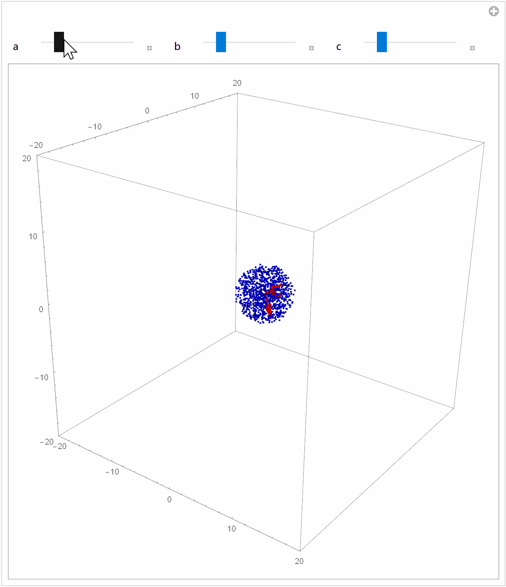

# 点云特征提取

点云的特征一般分为**线特征**和**面特征**，提取的方式如 LOAM 的方法。


**为什么可以通过协方差矩阵的特征向量表示点云的线特征和面特征？**

协方差矩阵可以表示点云之间的相互关系，特征向量可以理解为经过矩阵旋转后新的坐标轴，特征值就是在对应特征向量上面的大小。



当一簇点云它们的关系比较接近一条线时，可以想象([如上图](https://blog.csdn.net/robinvista/article/details/104379087?spm=1001.2014.3001.5502))，点云在某一个坐标轴上跨度大，而在另外两个坐标轴的跨度小，对应这特征值为一大两小，而这个大的特征值和对应的特征向量就可以用来表示这些点云的特征，即用这个特征向量表示点云线特征。

计算点到线的距离时，就可以把这簇点云其他两个维度的信息去掉，只保留最能描述该簇点云信息的坐标轴，计算点到该坐标轴的距离即可。

同样，当一簇点云它们的关系比较接近一个平面时，点云在两个坐标轴上的跨度相对大些，而在另外一个维度上小些，这样的话才可以是一个平面。特征向量对应的特征值为一小两大，这个小特征值对应的特征向量垂直于另外两个特征向量，也即垂直于它俩组成的平面，可以把这个小特征值对应的特征向量看成是平面的法向量。

计算点到平面的距离是，可以将点和坐标原点组成的向量投影到平面的法向量上，投影的长度就是点到平面的距离了。


注：

**协方差矩阵**

在统计学与概率论中，协方差矩阵的每个元素是各个向量元素之间的协方差，是从标量随机变量到高维度随机向量的自然推广。

在 PCL 中，计算点云的协方差矩阵的代码文件位于 “pcl/common/centroid.h”，简要代码如下：

```cpp
// 计算均值
void compute3DCentroid (const pcl::PointCloud<PointT> &cloud, 
                        Eigen::Matrix<Scalar, 3, 1> &centroid) {
  if (cloud.empty())
    return;

  centroid.setZero();

  for (size_t i = 0; i < cloud.size (); ++i) {
      centroid[0] += cloud[i].x;
      centroid[1] += cloud[i].y;
      centroid[2] += cloud[i].z;
  }
  centroid /= static_cast<Scalar>(cloud.size());

  return (static_cast<unsigned int> (cloud.size()));
}

// 计算协方差
void pcl::computeCovarianceMatrix (const pcl::PointCloud<PointT> &cloud,
                              const Eigen::Matrix<Scalar, 3, 1> &centroid,
                              Eigen::Matrix<Scalar, 3, 3> &covariance_matrix) {
  if (cloud.empty())
    return;

  covariance_matrix.setZero();

  unsigned point_count;

  point_count = static_cast<unsigned>(cloud.size());
  // For each point in the cloud
  for (size_t i = 0; i < point_count; ++i) {
      Eigen::Matrix<Scalar, 4, 1> pt;
      pt[0] = cloud[i].x - centroid[0];
      pt[1] = cloud[i].y - centroid[1];
      pt[2] = cloud[i].z - centroid[2];

      covariance_matrix(0, 0) += pt.x() * pt.x();
      covariance_matrix(0, 1) += pt.x() * pt.y();
      covariance_matrix(0, 2) += pt.x() * pt.z();
      covariance_matrix(1, 1) += pt.y() * pt.y();
      covariance_matrix(1, 2) += pt.y() * pt.z();
      covariance_matrix(2, 2) += pt.z() * pt.z();
  }
  covariance_matrix(1, 0) = covariance_matrix(0, 1);
  covariance_matrix(2, 0) = covariance_matrix(0, 2);
  covariance_matrix(2, 1) = covariance_matrix(1, 2);
  return;
}
```

