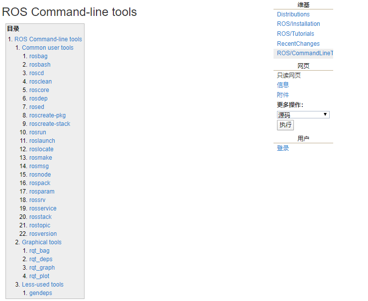

## 常用命令

机器人系统中启动的节点少则几个，多则十几个、几十个，不同的节点名称各异，通信时使用话题、服务、消息、参数等等都各不相同，一个显而易见的问题是: 当需要自定义节点和其他某个已经存在的节点通信时，如何获取对方的话题、以及消息载体的格式呢？

在 ROS 同提供了一些实用的命令行工具，可以用于获取不同节点的各类信息，常用的命令如下:

- rosnode : 操作节点
- rostopic : 操作话题
- rosservice : 操作服务
- rosmsg : 操作msg消息
- rossrv : 操作srv消息
- rosparam : 操作参数

------

#### **作用**

和之前介绍的文件系统操作命令比较，文件操作命令是静态的，操作的是磁盘上的文件，而上述命令是动态的，在ROS程序启动后，可以动态的获取运行中的节点或参数的相关信息。

#### 案例

本节将借助于2.1、2.2和2.3的通信实现介绍相关命令的基本使用，并通过练习ROS内置的小海龟例程来强化命令的应用。

------

**另请参考:**

- http://wiki.ros.org/ROS/CommandLineTools



### rosnode

rosnode 是用于获取节点信息的命令

```bash
rosnode ping    测试到节点的连接状态
rosnode list    列出活动节点
rosnode info    打印节点信息
rosnode machine    列出指定设备上节点
rosnode kill    杀死某个节点
rosnode cleanup    清除不可连接的节点
```

### rostopic

**rostopic**包含rostopic命令行工具，用于显示有关ROS 主题的调试信息，包括发布者，订阅者，发布频率和ROS消息。它还包含一个实验性Python库，用于动态获取有关主题的信息并与之交互。

```shell
rostopic bw     显示主题使用的带宽
rostopic delay  显示带有 header 的主题延迟
rostopic echo   打印消息到屏幕
rostopic find   根据类型查找主题
rostopic hz     显示主题的发布频率
rostopic info   显示主题相关信息
rostopic list   显示所有活动状态下的主题
rostopic pub    将数据发布到主题
rostopic type   打印主题类型
```

- **rostopic list**(-v)

    直接调用即可，控制台将打印当前运行状态下的主题名称

    rostopic list -v : 获取话题详情(比如列出：发布者和订阅者个数...)

- **rostopic pub**

    可以直接调用命令向订阅者发布消息

    为roboware 自动生成的 发布/订阅 模型案例中的 订阅者 发布一条字符串

    ```bash
    rostopic pub /主题名称 消息类型 消息内容
    rostopic pub /chatter std_msgs gagaxixi
    ```

    为 小乌龟案例的 订阅者 发布一条运动信息

    ```bash
    rostopic pub /turtle1/cmd_vel geometry_msgs/Twist
     "linear:
      x: 1.0
      y: 0.0
      z: 0.0
    angular:
      x: 0.0
      y: 0.0
      z: 2.0"
    # 只发布一次运动信息
    
    rostopic pub -r 10 /turtle1/cmd_vel geometry_msgs/Twist
     "linear:
      x: 1.0
      y: 0.0
      z: 0.0
    angular:
      x: 0.0
      y: 0.0
      z: 2.0"
    # 以 10HZ 的频率循环发送运动信息
    ```

- **rostpic echo**

    获取指定话题当前发布的消息

- **rostopic info**

    获取当前话题的小关信息

    消息类型

    发布者信息

    订阅者信息

- **rostopic type**

    列出话题的消息类型

- **rostopic find 消息类型**

    根据消息类型查找话题

- **rostopic delay**

    列出消息头信息

- **rostopic hz**

    列出消息发布频率

- **rostopic bw**

    列出消息发布带宽

### rosmsg

rosmsg是用于显示有关 ROS消息类型的 信息的命令行工具。

**rosmsg 演示**

```bash
rosmsg show    显示消息描述
rosmsg info    显示消息信息
rosmsg list    列出所有消息
rosmsg md5    显示 md5 加密后的消息
rosmsg package    显示某个功能包下的所有消息
rosmsg packages    列出包含消息的功能包
```

- rosmsg list

    会列出当前 ROS 中的所有 msg

- rosmsg packages

    列出包含消息的所有包

- rosmsg package

    列出某个包下的所有msg

    ```bash
    # rosmsg package 包名 
    rosmsg package turtlesim
    ```

- rosmsg show

    显示消息描述

    ```bash
    # rosmsg show 消息名称
    rosmsg show turtlesim/Pose
    # 结果:
    float32 x
    float32 y
    float32 theta
    float32 linear_velocity
    float32 angular_velocity
    ```

- rosmsg info

    作用与 rosmsg show 一样

- rosmsg md5 (资料]:[http://wiki.ros.org/ROS/Technical%20Overview#Message_serialization_and_msg_MD5_sums](http://wiki.ros.org/ROS/Technical Overview#Message_serialization_and_msg_MD5_sums))

    一种校验算法，保证数据传输的一致性

### rosservice

rosservice包含用于列出和查询ROS [Services](http://wiki.ros.org/Services)的rosservice命令行工具。

调用部分服务时，如果对相关工作空间没有配置 path，需要进入工作空间调用 source ./devel/setup.bash

```bash
rosservice args 打印服务参数
rosservice call    使用提供的参数调用服务
rosservice find    按照服务类型查找服务
rosservice info    打印有关服务的信息
rosservice list    列出所有活动的服务
rosservice type    打印服务类型
rosservice uri    打印服务的 ROSRPC uri
```

- rosservice list

    列出所有活动的 service

    ```bash
    ~ rosservice list
    /clear
    /kill
    /listener/get_loggers
    /listener/set_logger_level
    /reset
    /rosout/get_loggers
    /rosout/set_logger_level
    /rostopic_4985_1578723066421/get_loggers
    /rostopic_4985_1578723066421/set_logger_level
    /rostopic_5582_1578724343069/get_loggers
    /rostopic_5582_1578724343069/set_logger_level
    /spawn
    /turtle1/set_pen
    /turtle1/teleport_absolute
    /turtle1/teleport_relative
    /turtlesim/get_loggers
    /turtlesim/set_logger_level
    ```

- rosservice args

    打印服务参数

    ```bash
    rosservice args /spawn
    x y theta name
    ```

- rosservice call

    调用服务

    为小乌龟的案例生成一只新的乌龟

    ```shell
    rosservice call /spawn "x: 1.0
    y: 2.0
    theta: 0.0
    name: 'xxx'"
    name: "xxx"
    
    //生成一只叫 xxx 的乌龟
    ```

- rosservice find

    根据消息类型获取话题

- rosservice info

    获取服务话题详情

- rosservice type

    获取消息类型

- rosservice uri

    获取服务器 uri

### rossrv

rossrv是用于显示有关ROS服务类型的信息的命令行工具，与 rosmsg 使用语法高度雷同。

```bash
rossrv show    显示服务消息详情
rossrv info    显示服务消息相关信息
rossrv list    列出所有服务信息
rossrv md5    显示 md5 加密后的服务消息
rossrv package    显示某个包下所有服务消息
rossrv packages    显示包含服务消息的所有包
```

- rossrv list

    会列出当前 ROS 中的所有 srv 消息

- rossrv packages

    列出包含服务消息的所有包

- rossrv package

    列出某个包下的所有msg

    ```bash
    # rossrv package 包名 
    rossrv package turtlesim
    ```

- rossrv show

    显示消息描述

    ```bash
    # rossrv show 消息名称
    rossrv show turtlesim/Spawn
    # 结果:
    float32 x
    float32 y
    float32 theta
    string name
    ---
    string name
    ```

- rossrv info

    作用与 rossrv show 一致

- rossrv md5

    对 service 数据使用 md5 校验(加密)

### rosparam

rosparam包含rosparam命令行工具，用于使用YAML编码文件在参数服务器上获取和设置ROS参数。

```bash
rosparam set    设置参数
rosparam get    获取参数
rosparam load    从外部文件加载参数
rosparam dump    将参数写出到外部文件
rosparam delete    删除参数
rosparam list    列出所有参数
```

- rosparam list

    列出所有参数

    ```bash
    rosparam list
    
    # 默认结果
    /rosdistro
    /roslaunch/uris/host_helloros_virtual_machine__42911
    /rosversion
    /run_id
    ```

- rosparam set

    设置参数

    ```bash
    rosparam set name huluwa
    
    # 再次调用 rosparam list 结果
    /name
    /rosdistro
    /roslaunch/uris/host_helloros_virtual_machine__42911
    /rosversion
    /run_id
    ```

- rosparam get

    获取参数

    ```bash
    rosparam get name
    
    # 结果
    huluwa
    ```

- rosparam delete

    删除参数

    ```bash
    rosparam delete name
    
    #结果
    #去除了name
    ```

- rosparam load(先准备 yaml 文件)

    从外部文件加载参数

    ```bash
    rosparam load xxx.yaml
    ```

- rosparam dump

    将参数写出到外部文件

    ```bash
    rosparam dump yyy.yaml
    ```