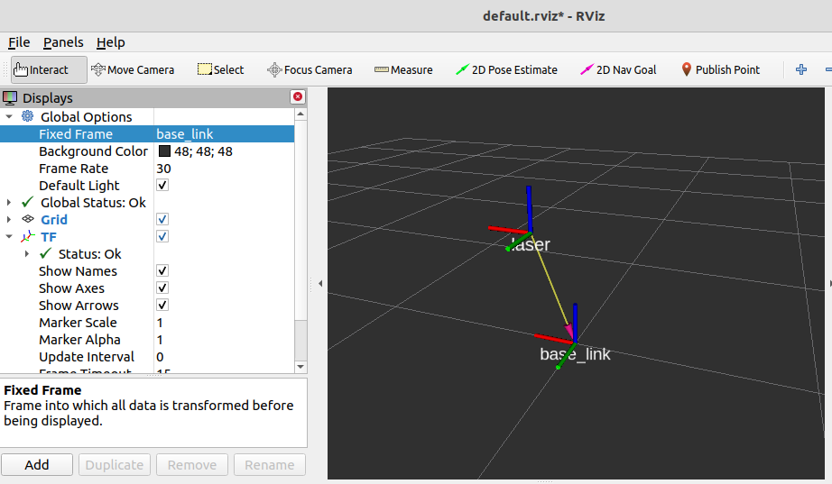
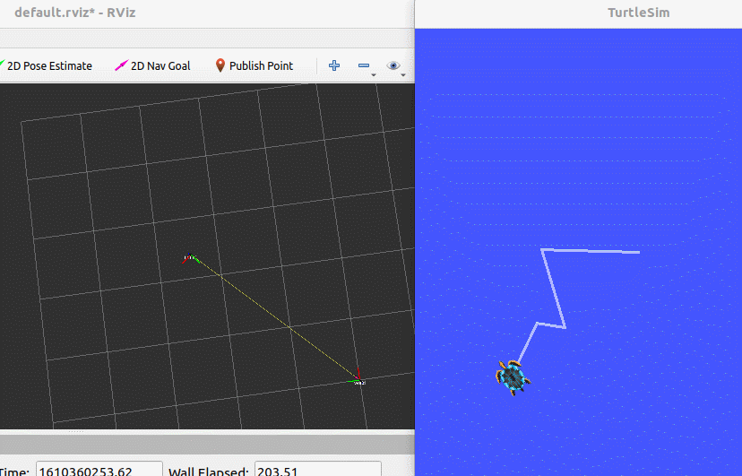
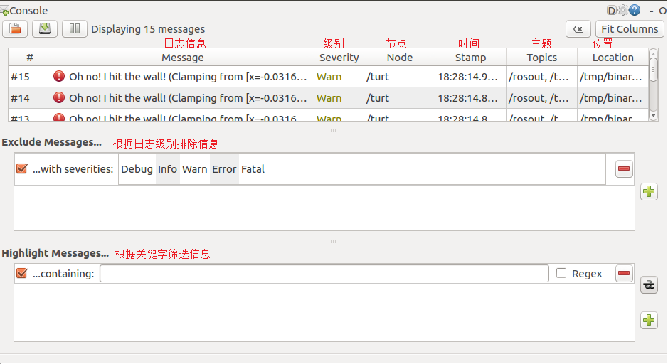
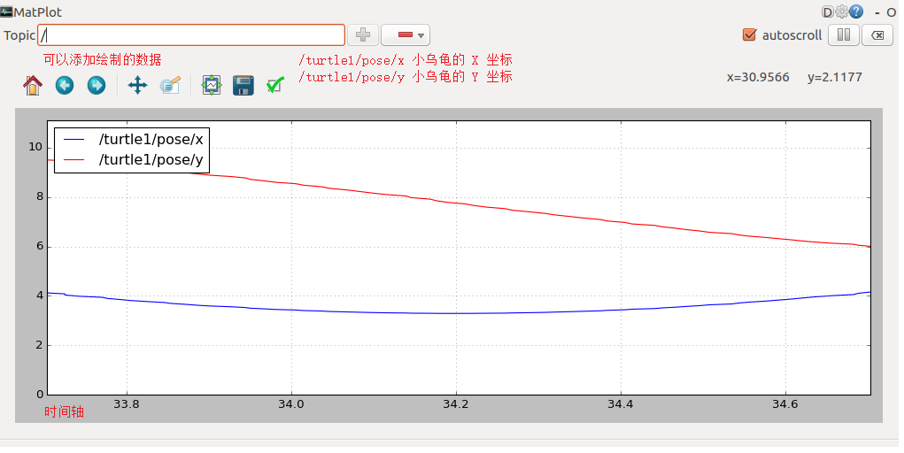

# ROS理论与实践

# 第 5 章 ROS常用组件

在ROS中内置一些比较实用的工具，通过这些工具可以方便快捷的实现某个功能或调试程序，从而提高开发效率，本章主要介绍ROS中内置的如下组件:

- TF坐标变换，实现不同类型的坐标系之间的转换；
- rosbag 用于录制ROS节点的执行过程并可以重放该过程；
- rqt 工具箱，集成了多款图形化的调试工具。

本章预期达成的学习目标:

- 了解 TF 坐标变换的概念以及应用场景；
- 能够独立完成TF案例:小乌龟跟随；
- 可以使用 rosbag 命令或编码的形式实现录制与回放；
- 能够熟练使用rqt中的图形化工具。

**案例演示:** 小乌龟跟随实现，该案例是ros中内置案例，终端下键入启动命令

```
roslaunch turtle_tf2 turtle_tf2_demo_cpp.launch`或`roslaunch turtle_tf2 turtle_tf2_demo.launch
```

键盘可以控制一只乌龟运动，另一只跟随运动。


## 5.1 TF坐标变换

机器人系统上，有多个传感器，如激光雷达、摄像头等，有的传感器是可以感知机器人周边的物体方位(或者称之为:坐标，横向、纵向、高度的距离信息)的，以协助机器人定位障碍物，可以直接将物体相对该传感器的方位信息，等价于物体相对于机器人系统或机器人其它组件的方位信息吗？显示是不行的，这中间需要一个转换过程。更具体描述如下:

> 场景1:雷达与小车
>
> 现有一移动式机器人底盘，在底盘上安装了一雷达，雷达相对于底盘的偏移量已知，现雷达检测到一障碍物信息，获取到坐标分别为(x,y,z)，该坐标是以雷达为参考系的，如何将这个坐标转换成以小车为参考系的坐标呢？


> 场景2:现有一带机械臂的机器人(比如:PR2)需要夹取目标物，当前机器人头部摄像头可以探测到目标物的坐标(x,y,z)，不过该坐标是以摄像头为参考系的，而实际操作目标物的是机械臂的夹具，当前我们需要将该坐标转换成相对于机械臂夹具的坐标，这个过程如何实现？


当然，根据我们高中学习的知识，在明确了不同坐标系之间的的相对关系，就可以实现任何坐标点在不同坐标系之间的转换，但是该计算实现是较为常用的，且算法也有点复杂，因此在 ROS 中直接封装了相关的模块: 坐标变换(TF)。

------

#### **概念**

**tf:**TransForm Frame,坐标变换

**坐标系:**ROS 中是通过坐标系统开标定物体的，确切的将是通过右手坐标系来标定的。


#### **作用**

在 ROS 中用于实现不同坐标系之间的点或向量的转换。

#### **案例**

**小乌龟跟随案例：**如本章引言部分演示。

#### 说明

在ROS中坐标变换最初对应的是tf，不过在 hydro 版本开始, tf 被弃用，迁移到 tf2,后者更为简洁高效，tf2对应的常用功能包有:

tf2_geometry_msgs:可以将ROS消息转换成tf2消息。

tf2: 封装了坐标变换的常用消息。

tf2_ros:为tf2提供了roscpp和rospy绑定，封装了坐标变换常用的API。

------

**另请参考:**

- http://wiki.ros.org/tf2

### 5.1.1 坐标msg消息

订阅发布模型中数据载体 msg 是一个重要实现，首先需要了解一下，在坐标转换实现中常用的 msg:`geometry_msgs/TransformStamped`和`geometry_msgs/PointStamped`

前者用于传输坐标系相关位置信息，后者用于传输某个坐标系内坐标点的信息。在坐标变换中，频繁的需要使用到坐标系的相对关系以及坐标点信息。

#### 1.geometry_msgs/TransformStamped

命令行键入:`rosmsg info geometry_msgs/TransformStamped`

```shell
std_msgs/Header header                     #头信息
  uint32 seq                                #|-- 序列号
  time stamp                                #|-- 时间戳
  string frame_id                            #|-- 坐标 ID
string child_frame_id                    #子坐标系的 id
geometry_msgs/Transform transform        #坐标信息
  geometry_msgs/Vector3 translation        #偏移量
    float64 x                                #|-- X 方向的偏移量
    float64 y                                #|-- Y 方向的偏移量
    float64 z                                #|-- Z 方向上的偏移量
  geometry_msgs/Quaternion rotation        #四元数
    float64 x                                
    float64 y                                
    float64 z                                
    float64 w
```

四元数用于表示坐标的相对姿态

#### 2.geometry_msgs/PointStamped

命令行键入:`rosmsg info geometry_msgs/PointStamped`

```shell
std_msgs/Header header                    #头
  uint32 seq                                #|-- 序号
  time stamp                                #|-- 时间戳
  string frame_id                            #|-- 所属坐标系的 id
geometry_msgs/Point point                #点坐标
  float64 x                                    #|-- x y z 坐标
  float64 y
  float64 z
```

------

**另请参考:**

- http://docs.ros.org/en/api/geometry_msgs/html/msg/TransformStamped.html
- http://docs.ros.org/en/api/geometry_msgs/html/msg/PointStamped.html

### 5.1.2 静态坐标变换

所谓静态坐标变换，是指两个坐标系之间的相对位置是固定的。

**需求描述:**

现有一机器人模型，核心构成包含主体与雷达，各对应一坐标系，坐标系的原点分别位于主体与雷达的物理中心，已知雷达原点相对于主体原点位移关系如下: x 0.2 y0.0 z0.5。当前雷达检测到一障碍物，在雷达坐标系中障碍物的坐标为 (2.0 3.0 5.0),请问，该障碍物相对于主体的坐标是多少？

**结果演示:**

**实现分析:**

1. 坐标系相对关系，可以通过发布方发布
2. 订阅方，订阅到发布的坐标系相对关系，再传入坐标点信息(可以写死)，然后借助于 tf 实现坐标变换，并将结果输出

**实现流程:**C++ 与 Python 实现流程一致

1. 新建功能包，添加依赖
2. 编写发布方实现
3. 编写订阅方实现
4. 执行并查看结果

------

方案A:C++实现

#### 1.创建功能包

创建项目功能包依赖于 tf2、tf2_ros、tf2_geometry_msgs、roscpp rospy std_msgs geometry_msgs

#### 2.发布方

```cpp
/* 
    静态坐标变换发布方:
        发布关于 laser 坐标系的位置信息 

    实现流程:
        1.包含头文件
        2.初始化 ROS 节点
        3.创建静态坐标转换广播器
        4.创建坐标系信息
        5.广播器发布坐标系信息
        6.spin()
*/


// 1.包含头文件
#include "ros/ros.h"
#include "tf2_ros/static_transform_broadcaster.h"
#include "geometry_msgs/TransformStamped.h"
#include "tf2/LinearMath/Quaternion.h"

int main(int argc, char *argv[])
{
    setlocale(LC_ALL,"");
    // 2.初始化 ROS 节点
    ros::init(argc,argv,"static_brocast");
    // 3.创建静态坐标转换广播器
    tf2_ros::StaticTransformBroadcaster broadcaster;
    // 4.创建坐标系信息
    geometry_msgs::TransformStamped ts;
    //----设置头信息
    ts.header.seq = 100;
    ts.header.stamp = ros::Time::now();
    ts.header.frame_id = "base_link";
    //----设置子级坐标系
    ts.child_frame_id = "laser";
    //----设置子级相对于父级的偏移量
    ts.transform.translation.x = 0.2;
    ts.transform.translation.y = 0.0;
    ts.transform.translation.z = 0.5;
    //----设置四元数:将 欧拉角数据转换成四元数
    tf2::Quaternion qtn;
    qtn.setRPY(0,0,0);
    ts.transform.rotation.x = qtn.getX();
    ts.transform.rotation.y = qtn.getY();
    ts.transform.rotation.z = qtn.getZ();
    ts.transform.rotation.w = qtn.getW();
    // 5.广播器发布坐标系信息
    broadcaster.sendTransform(ts);
    ros::spin();
    return 0;
}
```

配置文件此处略。

使用命令查看发布消息：

```shell
rostopic list	# 找到对应的话题名称
rostopic echo 话题名
```

使用图形化界面查看坐标相对关系：

在命令行中输入 `rviz`，点击 `Fixed Frame`，选择主坐标系，即 `base_link `，点击 `Add`，选择 `TF`。

#### 3.订阅方

```cpp
/*  
    订阅坐标系信息，生成一个相对于 子级坐标系的坐标点数据，转换成父级坐标系中的坐标点

    实现流程:
        1.包含头文件
        2.初始化 ROS 节点
        3.创建 TF 订阅节点
        4.生成一个坐标点(相对于子级坐标系)
        5.转换坐标点(相对于父级坐标系)
        6.spin()
*/
//1.包含头文件
#include "ros/ros.h"
#include "tf2_ros/transform_listener.h"
#include "tf2_ros/buffer.h"
#include "geometry_msgs/PointStamped.h"
#include "tf2_geometry_msgs/tf2_geometry_msgs.h" //注意: 调用 transform 必须包含该头文件

int main(int argc, char *argv[])
{
    setlocale(LC_ALL,"");
    // 2.初始化 ROS 节点
    ros::init(argc,argv,"tf_sub");
    ros::NodeHandle nh;
    // 3.创建 TF 订阅节点
    tf2_ros::Buffer buffer;
    tf2_ros::TransformListener listener(buffer);

    ros::Rate r(1);
    while (ros::ok())
    {
    // 4.生成一个坐标点(相对于子级坐标系)
        geometry_msgs::PointStamped point_laser;
        point_laser.header.frame_id = "laser";
        point_laser.header.stamp = ros::Time::now();
        point_laser.point.x = 1;
        point_laser.point.y = 2;
        point_laser.point.z = 7.3;
    // 5.转换坐标点(相对于父级坐标系)
        //新建一个坐标点，用于接收转换结果  
        //--------------使用 try 语句或休眠，否则可能由于缓存接收延迟而导致坐标转换失败------------------------
        try
        {
            geometry_msgs::PointStamped point_base;
            point_base = buffer.transform(point_laser,"base_link");
            ROS_INFO("转换后的数据:(%.2f,%.2f,%.2f),参考的坐标系是:%s",point_base.point.x,point_base.point.y,point_base.point.z,point_base.header.frame_id.c_str());
        }
        catch(const std::exception& e)
        {
            // std::cerr << e.what() << '\n';
            ROS_INFO("程序异常.....");
        }
        r.sleep();  
        ros::spinOnce();
    }
    return 0;
}
```

配置文件此处略。

#### 4.执行

可以使用命令行或launch文件的方式分别启动发布节点与订阅节点，如果程序无异常，控制台将输出，坐标转换后的结果。

------

方案B:Python实现

#### 1.创建功能包

创建项目功能包依赖于 tf2、tf2_ros、tf2_geometry_msgs、roscpp rospy std_msgs geometry_msgs

#### 2.发布方

```python
#! /usr/bin/env python
"""  
    静态坐标变换发布方:
        发布关于 laser 坐标系的位置信息 
    实现流程:
        1.导包
        2.初始化 ROS 节点
        3.创建 静态坐标广播器
        4.创建并组织被广播的消息
        5.广播器发送消息
        6.spin
"""
# 1.导包
import rospy
import tf2_ros
import tf
from geometry_msgs.msg import TransformStamped

if __name__ == "__main__":
    # 2.初始化 ROS 节点
    rospy.init_node("static_tf_pub_p")
    # 3.创建 静态坐标广播器
    broadcaster = tf2_ros.StaticTransformBroadcaster()
    # 4.创建并组织被广播的消息
    tfs = TransformStamped()
    # --- 头信息
    tfs.header.frame_id = "world"
    tfs.header.stamp = rospy.Time.now()
    tfs.header.seq = 101
    # --- 子坐标系
    tfs.child_frame_id = "radar"
    # --- 坐标系相对信息
    # ------ 偏移量
    tfs.transform.translation.x = 0.2
    tfs.transform.translation.y = 0.0
    tfs.transform.translation.z = 0.5
    # ------ 四元数
    qtn = tf.transformations.quaternion_from_euler(0,0,0)
    tfs.transform.rotation.x = qtn[0]
    tfs.transform.rotation.y = qtn[1]
    tfs.transform.rotation.z = qtn[2]
    tfs.transform.rotation.w = qtn[3]


    # 5.广播器发送消息
    broadcaster.sendTransform(tfs)
    # 6.spin
    rospy.spin()
```

权限设置以及配置文件此处略。

#### 3.订阅方

```python
#! /usr/bin/env python
"""  
    订阅坐标系信息，生成一个相对于 子级坐标系的坐标点数据，
    转换成父级坐标系中的坐标点

    实现流程:
        1.导包
        2.初始化 ROS 节点
        3.创建 TF 订阅对象
        4.创建一个 radar 坐标系中的坐标点
        5.调研订阅对象的 API 将 4 中的点坐标转换成相对于 world 的坐标
        6.spin

"""
# 1.导包
import rospy
import tf2_ros
# 不要使用 geometry_msgs,需要使用 tf2 内置的消息类型
from tf2_geometry_msgs import PointStamped
# from geometry_msgs.msg import PointStamped

if __name__ == "__main__":
    # 2.初始化 ROS 节点
    rospy.init_node("static_sub_tf_p")
    # 3.创建 TF 订阅对象
    buffer = tf2_ros.Buffer()
    listener = tf2_ros.TransformListener(buffer)

    rate = rospy.Rate(1)
    while not rospy.is_shutdown():    
    # 4.创建一个 radar 坐标系中的坐标点
        point_source = PointStamped()
        point_source.header.frame_id = "radar"
        point_source.header.stamp = rospy.Time.now()
        point_source.point.x = 10
        point_source.point.y = 2
        point_source.point.z = 3

        try:
    #     5.调研订阅对象的 API 将 4 中的点坐标转换成相对于 world 的坐标
            point_target = buffer.transform(point_source,"world")
            rospy.loginfo("转换结果:x = %.2f, y = %.2f, z = %.2f",
                            point_target.point.x,
                            point_target.point.y,
                            point_target.point.z)
        except Exception as e:
            rospy.logerr("异常:%s",e)

    #     6.spin
        rate.sleep()
```

权限设置以及配置文件此处略。

**PS: 在 tf2 的 python 实现中，tf2 已经封装了一些消息类型，不可以使用 geometry_msgs.msg 中的类型**

#### 4.执行

可以使用命令行或launch文件的方式分别启动发布节点与订阅节点，如果程序无异常，控制台将输出，坐标转换后的结果。

------

#### 补充1:

当坐标系之间的相对位置固定时，那么所需参数也是固定的: 父系坐标名称、子级坐标系名称、x偏移量、y偏移量、z偏移量、x 翻滚角度、y俯仰角度、z偏航角度，实现逻辑相同，参数不同，那么 ROS 系统就已经封装好了专门的节点，使用方式如下:

```shell
rosrun tf2_ros static_transform_publisher x偏移量 y偏移量 z偏移量 z偏航角度 y俯仰角度 x翻滚角度 父级坐标系 子级坐标系
```

示例:`rosrun tf2_ros static_transform_publisher 0.2 0 0.5 0 0 0 /baselink /laser`

也建议使用该种方式直接实现静态坐标系相对信息发布。

#### 补充2:

可以借助于rviz显示坐标系关系，具体操作:

- 新建窗口输入命令:rviz;
- 在启动的 rviz 中设置Fixed Frame 为 base_link;
- 点击左下的 add 按钮，在弹出的窗口中选择 TF 组件，即可显示坐标关系。

------

**另请参考:**

- [http://wiki.ros.org/tf2/Tutorials/Writing%20a%20tf2%20static%20broadcaster%20%28C%2B%2B%29](http://wiki.ros.org/tf2/Tutorials/Writing a tf2 static broadcaster (C%2B%2B))
- [http://wiki.ros.org/tf2/Tutorials/Writing%20a%20tf2%20static%20broadcaster%20%28Python%29](http://wiki.ros.org/tf2/Tutorials/Writing a tf2 static broadcaster (Python))
- [http://wiki.ros.org/tf2/Tutorials/Writing%20a%20tf2%20listener%20%28C%2B%2B%29](http://wiki.ros.org/tf2/Tutorials/Writing a tf2 listener (C%2B%2B))
- [http://wiki.ros.org/tf2/Tutorials/Writing%20a%20tf2%20listener%20%28Python%29](http://wiki.ros.org/tf2/Tutorials/Writing a tf2 listener (Python))

### 5.1.3 动态坐标变换

所谓动态坐标变换，是指两个坐标系之间的相对位置是变化的。

**需求描述:**

启动 turtlesim_node,该节点中窗体有一个世界坐标系(左下角为坐标系原点)，乌龟是另一个坐标系，键盘控制乌龟运动，将两个坐标系的相对位置动态发布。

**结果演示:**



**实现分析:**

1. 乌龟本身不但可以看作坐标系，也是世界坐标系中的一个坐标点
2. 订阅 turtle1/pose,可以获取乌龟在世界坐标系的 x坐标、y坐标、偏移量以及线速度和角速度
3. 将 pose 信息转换成 坐标系相对信息并发布

**实现流程:**C++ 与 Python 实现流程一致

1. 新建功能包，添加依赖
2. 创建坐标相对关系发布方(同时需要订阅乌龟位姿信息)
3. 创建坐标相对关系订阅方
4. 执行

------

方案A:C++实现

#### 1.创建功能包

创建项目功能包依赖于 tf2、tf2_ros、tf2_geometry_msgs、roscpp rospy std_msgs geometry_msgs、turtlesim

#### 2.发布方

```cpp
/*  
    动态的坐标系相对姿态发布(一个坐标系相对于另一个坐标系的相对姿态是不断变动的)

    需求: 启动 turtlesim_node,该节点中窗体有一个世界坐标系(左下角为坐标系原点)，乌龟是另一个坐标系，键盘
    控制乌龟运动，将两个坐标系的相对位置动态发布

    实现分析:
        1.乌龟本身不但可以看作坐标系，也是世界坐标系中的一个坐标点
        2.订阅 turtle1/pose,可以获取乌龟在世界坐标系的 x坐标、y坐标、偏移量以及线速度和角速度
        3.将 pose 信息转换成 坐标系相对信息并发布

    实现流程:
        1.包含头文件
        2.初始化 ROS 节点
        3.创建 ROS 句柄
        4.创建订阅对象
        5.回调函数处理订阅到的数据(实现TF广播)
            5-1.创建 TF 广播器
            5-2.创建 广播的数据(通过 pose 设置)
            5-3.广播器发布数据
        6.spin
*/
// 1.包含头文件
#include "ros/ros.h"
#include "turtlesim/Pose.h"
#include "tf2_ros/transform_broadcaster.h"
#include "geometry_msgs/TransformStamped.h"
#include "tf2/LinearMath/Quaternion.h"

void doPose(const turtlesim::Pose::ConstPtr& pose){
    //  5-1.创建 TF 广播器
    static tf2_ros::TransformBroadcaster broadcaster;
    //  5-2.创建 广播的数据(通过 pose 设置)
    geometry_msgs::TransformStamped tfs;
    //  |----头设置
    tfs.header.frame_id = "world";
    tfs.header.stamp = ros::Time::now();

    //  |----坐标系 ID
    tfs.child_frame_id = "turtle1";

    //  |----坐标系相对信息设置
    tfs.transform.translation.x = pose->x;
    tfs.transform.translation.y = pose->y;
    tfs.transform.translation.z = 0.0; // 二维实现，pose 中没有z，z 是 0
    //  |--------- 四元数设置
    tf2::Quaternion qtn;
    qtn.setRPY(0,0,pose->theta);
    tfs.transform.rotation.x = qtn.getX();
    tfs.transform.rotation.y = qtn.getY();
    tfs.transform.rotation.z = qtn.getZ();
    tfs.transform.rotation.w = qtn.getW();

    //  5-3.广播器发布数据
    broadcaster.sendTransform(tfs);
}

int main(int argc, char *argv[])
{
    setlocale(LC_ALL,"");
    // 2.初始化 ROS 节点
    ros::init(argc,argv,"dynamic_tf_pub");
    // 3.创建 ROS 句柄
    ros::NodeHandle nh;
    // 4.创建订阅对象
    ros::Subscriber sub = nh.subscribe<turtlesim::Pose>("/turtle1/pose",1000,doPose);
    //     5.回调函数处理订阅到的数据(实现TF广播)
    //        
    // 6.spin
    ros::spin();
    return 0;
}
```

配置文件此处略。

#### 3.订阅方

```cpp
//1.包含头文件
#include "ros/ros.h"
#include "tf2_ros/transform_listener.h"
#include "tf2_ros/buffer.h"
#include "geometry_msgs/PointStamped.h"
#include "tf2_geometry_msgs/tf2_geometry_msgs.h" //注意: 调用 transform 必须包含该头文件

int main(int argc, char *argv[])
{
    setlocale(LC_ALL,"");
    // 2.初始化 ROS 节点
    ros::init(argc,argv,"dynamic_tf_sub");
    ros::NodeHandle nh;
    // 3.创建 TF 订阅节点
    tf2_ros::Buffer buffer;
    tf2_ros::TransformListener listener(buffer);

    ros::Rate r(1);
    while (ros::ok())
    {
    // 4.生成一个坐标点(相对于子级坐标系)
        geometry_msgs::PointStamped point_laser;
        point_laser.header.frame_id = "turtle1";
        point_laser.header.stamp = ros::Time();
        point_laser.point.x = 1;
        point_laser.point.y = 1;
        point_laser.point.z = 0;
    // 5.转换坐标点(相对于父级坐标系)
        //新建一个坐标点，用于接收转换结果  
        //--------------使用 try 语句或休眠，否则可能由于缓存接收延迟而导致坐标转换失败------------------------
        try
        {
            geometry_msgs::PointStamped point_base;
            point_base = buffer.transform(point_laser,"world");
            ROS_INFO("坐标点相对于 world 的坐标为:(%.2f,%.2f,%.2f)",point_base.point.x,point_base.point.y,point_base.point.z);
        }
        catch(const std::exception& e)
        {
            // std::cerr << e.what() << '\n';
            ROS_INFO("程序异常:%s",e.what());
        }
        r.sleep();  
        ros::spinOnce();
    }
    return 0;
}
```

配置文件此处略。

#### 4.执行

可以使用命令行或launch文件的方式分别启动发布节点与订阅节点，如果程序无异常，与演示结果类似。

可以使用 rviz 查看坐标系相对关系。

------

方案B:Python实现

#### 1.创建功能包

创建项目功能包依赖于 tf2、tf2_ros、tf2_geometry_msgs、roscpp rospy std_msgs geometry_msgs、turtlesim

#### 2.发布方

```python
#! /usr/bin/env python
"""  
    动态的坐标系相对姿态发布(一个坐标系相对于另一个坐标系的相对姿态是不断变动的)

    需求: 启动 turtlesim_node,该节点中窗体有一个世界坐标系(左下角为坐标系原点)，乌龟是另一个坐标系，键盘
    控制乌龟运动，将两个坐标系的相对位置动态发布

    实现分析:
        1.乌龟本身不但可以看作坐标系，也是世界坐标系中的一个坐标点
        2.订阅 turtle1/pose,可以获取乌龟在世界坐标系的 x坐标、y坐标、偏移量以及线速度和角速度
        3.将 pose 信息转换成 坐标系相对信息并发布
    实现流程:
        1.导包
        2.初始化 ROS 节点
        3.订阅 /turtle1/pose 话题消息
        4.回调函数处理
            4-1.创建 TF 广播器
            4-2.创建 广播的数据(通过 pose 设置)
            4-3.广播器发布数据
        5.spin
"""
# 1.导包
import rospy
import tf2_ros
import tf
from turtlesim.msg import Pose
from geometry_msgs.msg import TransformStamped

#     4.回调函数处理
def doPose(pose):
    #         4-1.创建 TF 广播器
    broadcaster = tf2_ros.TransformBroadcaster()
    #         4-2.创建 广播的数据(通过 pose 设置)
    tfs = TransformStamped()
    tfs.header.frame_id = "world"
    tfs.header.stamp = rospy.Time.now()
    tfs.child_frame_id = "turtle1"
    tfs.transform.translation.x = pose.x
    tfs.transform.translation.y = pose.y
    tfs.transform.translation.z = 0.0
    qtn = tf.transformations.quaternion_from_euler(0,0,pose.theta)
    tfs.transform.rotation.x = qtn[0]
    tfs.transform.rotation.y = qtn[1]
    tfs.transform.rotation.z = qtn[2]
    tfs.transform.rotation.w = qtn[3]
    #         4-3.广播器发布数据
    broadcaster.sendTransform(tfs)

if __name__ == "__main__":
    # 2.初始化 ROS 节点
    rospy.init_node("dynamic_tf_pub_p")
    # 3.订阅 /turtle1/pose 话题消息
    sub = rospy.Subscriber("/turtle1/pose",Pose,doPose)
    #     4.回调函数处理
    #         4-1.创建 TF 广播器
    #         4-2.创建 广播的数据(通过 pose 设置)
    #         4-3.广播器发布数据
    #     5.spin
    rospy.spin()
```

权限设置以及配置文件此处略。

#### 3.订阅方

```python
#! /usr/bin/env python
"""  
    动态的坐标系相对姿态发布(一个坐标系相对于另一个坐标系的相对姿态是不断变动的)

    需求: 启动 turtlesim_node,该节点中窗体有一个世界坐标系(左下角为坐标系原点)，乌龟是另一个坐标系，键盘
    控制乌龟运动，将两个坐标系的相对位置动态发布

    实现分析:
        1.乌龟本身不但可以看作坐标系，也是世界坐标系中的一个坐标点
        2.订阅 turtle1/pose,可以获取乌龟在世界坐标系的 x坐标、y坐标、偏移量以及线速度和角速度
        3.将 pose 信息转换成 坐标系相对信息并发布
    实现流程:
        1.导包
        2.初始化 ROS 节点
        3.创建 TF 订阅对象
        4.处理订阅的数据


"""
# 1.导包
import rospy
import tf2_ros
# 不要使用 geometry_msgs,需要使用 tf2 内置的消息类型
from tf2_geometry_msgs import PointStamped
# from geometry_msgs.msg import PointStamped

if __name__ == "__main__":
    # 2.初始化 ROS 节点
    rospy.init_node("static_sub_tf_p")
    # 3.创建 TF 订阅对象
    buffer = tf2_ros.Buffer()
    listener = tf2_ros.TransformListener(buffer)

    rate = rospy.Rate(1)
    while not rospy.is_shutdown():    
    # 4.创建一个 radar 坐标系中的坐标点
        point_source = PointStamped()
        point_source.header.frame_id = "turtle1"
        point_source.header.stamp = rospy.Time.now()
        point_source.point.x = 10
        point_source.point.y = 2
        point_source.point.z = 3

        try:
    #     5.调研订阅对象的 API 将 4 中的点坐标转换成相对于 world 的坐标
            point_target = buffer.transform(point_source,"world",rospy.Duration(1))
            rospy.loginfo("转换结果:x = %.2f, y = %.2f, z = %.2f",
                            point_target.point.x,
                            point_target.point.y,
                            point_target.point.z)
        except Exception as e:
            rospy.logerr("异常:%s",e)

    #     6.spin
        rate.sleep()
```

权限设置以及配置文件此处略。

#### 4.执行

可以使用命令行或launch文件的方式分别启动发布节点与订阅节点，如果程序无异常，与演示结果类似。

可以使用 rviz 查看坐标系相对关系。

------

**另请参考:**

- [http://wiki.ros.org/tf2/Tutorials/Writing%20a%20tf2%20broadcaster%20%28C%2B%2B%29](http://wiki.ros.org/tf2/Tutorials/Writing a tf2 broadcaster (C%2B%2B))
- [http://wiki.ros.org/tf2/Tutorials/Writing%20a%20tf2%20broadcaster%20%28Python%29](http://wiki.ros.org/tf2/Tutorials/Writing a tf2 broadcaster (Python))

### 5.1.4 多坐标变换

**需求描述:**

现有坐标系统，父级坐标系统 world,下有两子级系统 son1，son2，son1 相对于 world，以及 son2 相对于 world 的关系是已知的，求 son1原点在 son2中的坐标，又已知在 son1中一点的坐标，要求求出该点在 son2 中的坐标

**实现分析:**

1. 首先，需要发布 son1 相对于 world，以及 son2 相对于 world 的坐标消息
2. 然后，需要订阅坐标发布消息，并取出订阅的消息，借助于 tf2 实现 son1 和 son2 的转换
3. 最后，还要实现坐标点的转换

**实现流程:**C++ 与 Python 实现流程一致

1. 新建功能包，添加依赖
2. 创建坐标相对关系发布方(需要发布两个坐标相对关系)
3. 创建坐标相对关系订阅方
4. 执行

------

方案A:C++实现

#### 1.创建功能包

创建项目功能包依赖于 tf2、tf2_ros、tf2_geometry_msgs、roscpp rospy std_msgs geometry_msgs

#### 2.发布方

为了方便，使用静态坐标变换发布

```xml
<launch>
    <node pkg="tf2_ros" type="static_transform_publisher" name="son1" args="0.2 0.8 0.3 0 0 0 /world /son1" output="screen" />
    <node pkg="tf2_ros" type="static_transform_publisher" name="son2" args="0.5 0 0 0 0 0 /world /son2" output="screen" />
</launch>
```

#### 3.订阅方

```cpp
/*

需求:
    现有坐标系统，父级坐标系统 world,下有两子级系统 son1，son2，
    son1 相对于 world，以及 son2 相对于 world 的关系是已知的，
    求 son1 与 son2中的坐标关系，又已知在 son1中一点的坐标，要求求出该点在 son2 中的坐标
实现流程:
    1.包含头文件
    2.初始化 ros 节点
    3.创建 ros 句柄
    4.创建 TF 订阅对象
    5.解析订阅信息中获取 son1 坐标系原点在 son2 中的坐标
      解析 son1 中的点相对于 son2 的坐标
    6.spin

*/
//1.包含头文件
#include "ros/ros.h"
#include "tf2_ros/transform_listener.h"
#include "tf2_ros/buffer.h"
#include "tf2/LinearMath/Quaternion.h"
#include "tf2_geometry_msgs/tf2_geometry_msgs.h"
#include "geometry_msgs/TransformStamped.h"
#include "geometry_msgs/PointStamped.h"

int main(int argc, char *argv[])
{   setlocale(LC_ALL,"");
    // 2.初始化 ros 节点
    ros::init(argc,argv,"sub_frames");
    // 3.创建 ros 句柄
    ros::NodeHandle nh;
    // 4.创建 TF 订阅对象
    tf2_ros::Buffer buffer; 
    tf2_ros::TransformListener listener(buffer);
    // 5.解析订阅信息中获取 son1 坐标系原点在 son2 中的坐标
    ros::Rate r(1);
    while (ros::ok())
    {
        try
        {
        //   解析 son1 中的点相对于 son2 的坐标
            geometry_msgs::TransformStamped tfs = buffer.lookupTransform("son2","son1",ros::Time(0));
            ROS_INFO("Son1 相对于 Son2 的坐标关系:父坐标系ID=%s",tfs.header.frame_id.c_str());
            ROS_INFO("Son1 相对于 Son2 的坐标关系:子坐标系ID=%s",tfs.child_frame_id.c_str());
            ROS_INFO("Son1 相对于 Son2 的坐标关系:x=%.2f,y=%.2f,z=%.2f",
                    tfs.transform.translation.x,
                    tfs.transform.translation.y,
                    tfs.transform.translation.z
                    );

            // 坐标点解析
            geometry_msgs::PointStamped ps;
            ps.header.frame_id = "son1";
            ps.header.stamp = ros::Time::now();
            ps.point.x = 1.0;
            ps.point.y = 2.0;
            ps.point.z = 3.0;

            geometry_msgs::PointStamped psAtSon2;
            psAtSon2 = buffer.transform(ps,"son2");
            ROS_INFO("在 Son2 中的坐标:x=%.2f,y=%.2f,z=%.2f",
                    psAtSon2.point.x,
                    psAtSon2.point.y,
                    psAtSon2.point.z
                    );
        }
        catch(const std::exception& e)
        {
            // std::cerr << e.what() << '\n';
            ROS_INFO("异常信息:%s",e.what());
        }
        r.sleep();
        // 6.spin
        ros::spinOnce();
    }
    return 0;
}
```

配置文件此处略。

#### 4.执行

可以使用命令行或launch文件的方式分别启动发布节点与订阅节点，如果程序无异常，将输出换算后的结果。

------

方案B:Python实现

#### 1.创建功能包

创建项目功能包依赖于 tf2、tf2_ros、tf2_geometry_msgs、roscpp rospy std_msgs geometry_msgs、turtlesim

#### 2.发布方

为了方便，使用静态坐标变换发布

```xml
<launch>
    <node pkg="tf2_ros" type="static_transform_publisher" name="son1" args="0.2 0.8 0.3 0 0 0 /world /son1" output="screen" />
    <node pkg="tf2_ros" type="static_transform_publisher" name="son2" args="0.5 0 0 0 0 0 /world /son2" output="screen" />
</launch>
```

#### 3.订阅方

```python
#!/usr/bin/env python
"""  
    需求:
        现有坐标系统，父级坐标系统 world,下有两子级系统 son1，son2，
        son1 相对于 world，以及 son2 相对于 world 的关系是已知的，
        求 son1 与 son2中的坐标关系，又已知在 son1中一点的坐标，要求求出该点在 son2 中的坐标
    实现流程:   
        1.导包
        2.初始化 ROS 节点
        3.创建 TF 订阅对象
        4.调用 API 求出 son1 相对于 son2 的坐标关系
        5.创建一依赖于 son1 的坐标点，调用 API 求出该点在 son2 中的坐标
        6.spin

"""
# 1.导包
import rospy
import tf2_ros
from geometry_msgs.msg import TransformStamped
from tf2_geometry_msgs import PointStamped

if __name__ == "__main__":

    # 2.初始化 ROS 节点
    rospy.init_node("frames_sub_p")
    # 3.创建 TF 订阅对象
    buffer = tf2_ros.Buffer()
    listener = tf2_ros.TransformListener(buffer)

    rate = rospy.Rate(1)
    while not rospy.is_shutdown():

        try:
        # 4.调用 API 求出 son1 相对于 son2 的坐标关系
            #lookup_transform(self, target_frame, source_frame, time, timeout=rospy.Duration(0.0)):
            tfs = buffer.lookup_transform("son2","son1",rospy.Time(0))
            rospy.loginfo("son1 与 son2 相对关系:")
            rospy.loginfo("父级坐标系:%s",tfs.header.frame_id)
            rospy.loginfo("子级坐标系:%s",tfs.child_frame_id)
            rospy.loginfo("相对坐标:x=%.2f, y=%.2f, z=%.2f",
                        tfs.transform.translation.x,
                        tfs.transform.translation.y,
                        tfs.transform.translation.z,
            )
        # 5.创建一依赖于 son1 的坐标点，调用 API 求出该点在 son2 中的坐标
            point_source = PointStamped()
            point_source.header.frame_id = "son1"
            point_source.header.stamp = rospy.Time.now()
            point_source.point.x = 1
            point_source.point.y = 1
            point_source.point.z = 1

            point_target = buffer.transform(point_source,"son2",rospy.Duration(0.5))

            rospy.loginfo("point_target 所属的坐标系:%s",point_target.header.frame_id)
            rospy.loginfo("坐标点相对于 son2 的坐标:(%.2f,%.2f,%.2f)",
                        point_target.point.x,
                        point_target.point.y,
                        point_target.point.z
            )

        except Exception as e:
            rospy.logerr("错误提示:%s",e)

        rate.sleep()
    # 6.spin    
    # rospy.spin()
```

权限设置以及配置文件此处略。

#### 4.执行

可以使用命令行或launch文件的方式分别启动发布节点与订阅节点，如果程序无异常，将输出换算后的结果。

### 5.1.5 坐标系关系查看

在机器人系统中，涉及的坐标系有多个，为了方便查看，ros 提供了专门的工具，可以用于生成显示坐标系关系的 pdf 文件，该文件包含树形结构的坐标系图谱。

#### 1准备

首先调用`rospack find tf2_tools`查看是否包含该功能包，如果没有，请使用如下命令安装:

```shell
sudo apt install ros-noetic-tf2-tools
```

#### 2使用

##### 2.1生成 pdf 文件

启动坐标系广播程序之后，运行如下命令:

```shell
rosrun tf2_tools view_frames.py
```

会产生类似于下面的日志信息:

```shell
[INFO] [1592920556.827549]: Listening to tf data during 5 seconds...
[INFO] [1592920561.841536]: Generating graph in frames.pdf file...
```

查看当前目录会生成一个 frames.pdf 文件

##### 2.2查看文件

可以直接进入目录打开文件，或者调用命令查看文件:`evince frames.pdf`

内如如图所示:

------

**另请参考:**

- http://wiki.ros.org/tf2_tools

### 5.1.6 TF坐标变换实操

**需求描述:**

程序启动之初: 产生两只乌龟，中间的乌龟(A) 和 左下乌龟(B), B 会自动运行至A的位置，并且键盘控制时，只是控制 A 的运动，但是 B 可以跟随 A 运行

**结果演示:**


**实现分析:**

乌龟跟随实现的核心，是乌龟A和B都要发布相对世界坐标系的坐标信息，然后，订阅到该信息需要转换获取A相对于B坐标系的信息，最后，再生成速度信息，并控制B运动。

1. 启动乌龟显示节点
2. 在乌龟显示窗体中生成一只新的乌龟(需要使用服务)
3. 编写两只乌龟发布坐标信息的节点
4. 编写订阅节点订阅坐标信息并生成新的相对关系生成速度信息

**实现流程:**C++ 与 Python 实现流程一致

1. 新建功能包，添加依赖
2. 编写服务客户端，用于生成一只新的乌龟
3. 编写发布方，发布两只乌龟的坐标信息
4. 编写订阅方，订阅两只乌龟信息，生成速度信息并发布
5. 运行

**准备工作:**

1.了解如何创建第二只乌龟，且不受键盘控制

创建第二只乌龟需要使用rosservice,话题使用的是 spawn

```shell
rosservice call /spawn "x: 1.0
y: 1.0
theta: 1.0
name: 'turtle_flow'" 
name: "turtle_flow"
```

键盘是无法控制第二只乌龟运动的，因为使用的话题: /第二只乌龟名称/cmd_vel,对应的要控制乌龟运动必须发布对应的话题消息

2.了解如何获取两只乌龟的坐标

是通过话题 /乌龟名称/pose 来获取的

```bash
x: 1.0 #x坐标
y: 1.0 #y坐标
theta: -1.21437060833 #角度
linear_velocity: 0.0 #线速度
angular_velocity: 1.0 #角速度
```

------

方案A:C++实现

#### 1.创建功能包

创建项目功能包依赖于 tf2、tf2_ros、tf2_geometry_msgs、roscpp rospy std_msgs geometry_msgs、turtlesim

#### 2.服务客户端(生成乌龟)

```cpp
/* 
    创建第二只小乌龟
 */
#include "ros/ros.h"
#include "turtlesim/Spawn.h"

int main(int argc, char *argv[])
{

    setlocale(LC_ALL,"");

    //执行初始化
    ros::init(argc,argv,"create_turtle");
    //创建节点
    ros::NodeHandle nh;
    //创建服务客户端
    ros::ServiceClient client = nh.serviceClient<turtlesim::Spawn>("/spawn");

    ros::service::waitForService("/spawn");
    turtlesim::Spawn spawn;
    spawn.request.name = "turtle2";
    spawn.request.x = 1.0;
    spawn.request.y = 2.0;
    spawn.request.theta = 3.1415926;
    bool flag = client.call(spawn);
    if (flag)
    {
        ROS_INFO("乌龟%s创建成功!",spawn.response.name.c_str());
    }
    else
    {
        ROS_INFO("乌龟2创建失败!");
    }

    ros::spin();

    return 0;
}
```

配置文件此处略。

#### 3.发布方(发布两只乌龟的坐标信息)

可以订阅乌龟的位姿信息，然后再转换成坐标信息，两只乌龟的实现逻辑相同，只是订阅的话题名称，生成的坐标信息等稍有差异，可以将差异部分通过参数传入:

- 该节点需要启动两次
- 每次启动时都需要传入乌龟节点名称(第一次是 turtle1 第二次是 turtle2)

```cpp
/*  
    该文件实现:需要订阅 turtle1 和 turtle2 的 pose，然后广播相对 world 的坐标系信息

    注意: 订阅的两只 turtle,除了命名空间(turtle1 和 turtle2)不同外,
          其他的话题名称和实现逻辑都是一样的，
          所以我们可以将所需的命名空间通过 args 动态传入

    实现流程:
        1.包含头文件
        2.初始化 ros 节点
        3.解析传入的命名空间
        4.创建 ros 句柄
        5.创建订阅对象
        6.回调函数处理订阅的 pose 信息
            6-1.创建 TF 广播器
            6-2.将 pose 信息转换成 TransFormStamped
            6-3.发布
        7.spin

*/
//1.包含头文件
#include "ros/ros.h"
#include "turtlesim/Pose.h"
#include "tf2_ros/transform_broadcaster.h"
#include "tf2/LinearMath/Quaternion.h"
#include "geometry_msgs/TransformStamped.h"

//保存乌龟名称
std::string turtle_name;

void doPose(const turtlesim::Pose::ConstPtr& pose){
    //  6-1.创建 TF 广播器 ---------------------------------------- 注意 static
    static tf2_ros::TransformBroadcaster broadcaster;
    //  6-2.将 pose 信息转换成 TransFormStamped
    geometry_msgs::TransformStamped tfs;
    tfs.header.frame_id = "world";
    tfs.header.stamp = ros::Time::now();
    tfs.child_frame_id = turtle_name;
    tfs.transform.translation.x = pose->x;
    tfs.transform.translation.y = pose->y;
    tfs.transform.translation.z = 0.0;
    tf2::Quaternion qtn;
    qtn.setRPY(0,0,pose->theta);
    tfs.transform.rotation.x = qtn.getX();
    tfs.transform.rotation.y = qtn.getY();
    tfs.transform.rotation.z = qtn.getZ();
    tfs.transform.rotation.w = qtn.getW();
    //  6-3.发布
    broadcaster.sendTransform(tfs);
} 

int main(int argc, char *argv[])
{
    setlocale(LC_ALL,"");
    // 2.初始化 ros 节点
    ros::init(argc,argv,"pub_tf");
    // 3.解析传入的命名空间
    if (argc != 2)
    {
        ROS_ERROR("请传入正确的参数");
    } else {
        turtle_name = argv[1];
        ROS_INFO("乌龟 %s 坐标发送启动",turtle_name.c_str());
    }

    // 4.创建 ros 句柄
    ros::NodeHandle nh;
    // 5.创建订阅对象
    ros::Subscriber sub = nh.subscribe<turtlesim::Pose>(turtle_name + "/pose",1000,doPose);
    //     6.回调函数处理订阅的 pose 信息
    //         6-1.创建 TF 广播器
    //         6-2.将 pose 信息转换成 TransFormStamped
    //         6-3.发布
    // 7.spin
    ros::spin();
    return 0;
}
```

配置文件此处略。

#### 4.订阅方(解析坐标信息并生成速度信息)

```cpp
/*  
    订阅 turtle1 和 turtle2 的 TF 广播信息，查找并转换时间最近的 TF 信息
    将 turtle1 转换成相对 turtle2 的坐标，在计算线速度和角速度并发布

    实现流程:
        1.包含头文件
        2.初始化 ros 节点
        3.创建 ros 句柄
        4.创建 TF 订阅对象
        5.处理订阅到的 TF
        6.spin

*/
//1.包含头文件
#include "ros/ros.h"
#include "tf2_ros/buffer.h"
#include "tf2_ros/transform_listener.h"
#include "geometry_msgs/TransformStamped.h"
#include "geometry_msgs/Twist.h"

int main(int argc, char *argv[])
{
    setlocale(LC_ALL,"");
    // 2.初始化 ros 节点
    ros::init(argc,argv,"sub_TF");
    // 3.创建 ros 句柄
    ros::NodeHandle nh;
    // 4.创建 TF 订阅对象
    tf2_ros::Buffer buffer;
    tf2_ros::TransformListener listener(buffer);
    // 5.处理订阅到的 TF

    // 需要创建发布 /turtle2/cmd_vel 的 publisher 对象

    ros::Publisher pub = nh.advertise<geometry_msgs::Twist>("/turtle2/cmd_vel",1000);

    ros::Rate rate(10);
    while (ros::ok())
    {
        try
        {
            //5-1.先获取 turtle1 相对 turtle2 的坐标信息
            geometry_msgs::TransformStamped tfs = buffer.lookupTransform("turtle2","turtle1",ros::Time(0));

            //5-2.根据坐标信息生成速度信息 -- geometry_msgs/Twist.h
            geometry_msgs::Twist twist;
            twist.linear.x = 0.5 * sqrt(pow(tfs.transform.translation.x,2) + pow(tfs.transform.translation.y,2));
            twist.angular.z = 4 * atan2(tfs.transform.translation.y,tfs.transform.translation.x);

            //5-3.发布速度信息 -- 需要提前创建 publish 对象
            pub.publish(twist);
        }
        catch(const std::exception& e)
        {
            // std::cerr << e.what() << '\n';
            ROS_INFO("错误提示:%s",e.what());
        }

        rate.sleep();
        // 6.spin
        ros::spinOnce();
    }

    return 0;
}
```

配置文件此处略。

#### 5.运行

使用 launch 文件组织需要运行的节点，内容示例如下:

```xml
<!--
    tf2 实现小乌龟跟随案例
-->
<launch>
    <!-- 启动乌龟节点与键盘控制节点 -->
    <node pkg="turtlesim" type="turtlesim_node" name="turtle1" output="screen" />
    <node pkg="turtlesim" type="turtle_teleop_key" name="key_control" output="screen"/>
    <!-- 启动创建第二只乌龟的节点 -->
    <node pkg="demo_tf2_test" type="Test01_Create_Turtle2" name="turtle2" output="screen" />
    <!-- 启动两个坐标发布节点 -->
    <node pkg="demo_tf2_test" type="Test02_TF2_Caster" name="caster1" output="screen" args="turtle1" />
    <node pkg="demo_tf2_test" type="Test02_TF2_Caster" name="caster2" output="screen" args="turtle2" />
    <!-- 启动坐标转换节点 -->
    <node pkg="demo_tf2_test" type="Test03_TF2_Listener" name="listener" output="screen" />
</launch>
```

------

方案B:Python实现

#### 1.创建功能包

创建项目功能包依赖于 tf2、tf2_ros、tf2_geometry_msgs、roscpp rospy std_msgs geometry_msgs、turtlesim

#### 2.服务客户端(生成乌龟)

```python
#! /usr/bin/env python
"""  
    调用 service 服务在窗体指定位置生成一只乌龟
    流程:
        1.导包
        2.初始化 ros 节点
        3.创建服务客户端
        4.等待服务启动
        5.创建请求数据
        6.发送请求并处理响应
"""
#1.导包
import rospy
from turtlesim.srv import Spawn, SpawnRequest, SpawnResponse

if __name__ == "__main__":
    # 2.初始化 ros 节点
    rospy.init_node("turtle_spawn_p")
    # 3.创建服务客户端
    client = rospy.ServiceProxy("/spawn",Spawn)
    # 4.等待服务启动
    client.wait_for_service()
    # 5.创建请求数据
    req = SpawnRequest()
    req.x = 1.0
    req.y = 1.0
    req.theta = 3.14
    req.name = "turtle2"
    # 6.发送请求并处理响应
    try:
        response = client.call(req)
        rospy.loginfo("乌龟创建成功，名字是:%s",response.name)
    except Exception as e:
        rospy.loginfo("服务调用失败....")
```

权限设置以及配置文件此处略。

#### 3.发布方(发布两只乌龟的坐标信息)

```python
#! /usr/bin/env python
"""  
    该文件实现:需要订阅 turtle1 和 turtle2 的 pose，然后广播相对 world 的坐标系信息

    注意: 订阅的两只 turtle,除了命名空间(turtle1 和 turtle2)不同外,
          其他的话题名称和实现逻辑都是一样的，
          所以我们可以将所需的命名空间通过 args 动态传入

    实现流程:
        1.导包
        2.初始化 ros 节点
        3.解析传入的命名空间
        4.创建订阅对象
        5.回调函数处理订阅的 pose 信息
            5-1.创建 TF 广播器
            5-2.将 pose 信息转换成 TransFormStamped
            5-3.发布
        6.spin
"""
# 1.导包
import rospy
import sys
from turtlesim.msg import Pose
from geometry_msgs.msg import TransformStamped
import tf2_ros
import tf_conversions

turtle_name = ""

def doPose(pose):
    # rospy.loginfo("x = %.2f",pose.x)
    #1.创建坐标系广播器
    broadcaster = tf2_ros.TransformBroadcaster()
    #2.将 pose 信息转换成 TransFormStamped
    tfs = TransformStamped()
    tfs.header.frame_id = "world"
    tfs.header.stamp = rospy.Time.now()

    tfs.child_frame_id = turtle_name
    tfs.transform.translation.x = pose.x
    tfs.transform.translation.y = pose.y
    tfs.transform.translation.z = 0.0

    qtn = tf_conversions.transformations.quaternion_from_euler(0, 0, pose.theta)
    tfs.transform.rotation.x = qtn[0]
    tfs.transform.rotation.y = qtn[1]
    tfs.transform.rotation.z = qtn[2]
    tfs.transform.rotation.w = qtn[3]

    #3.广播器发布 tfs
    broadcaster.sendTransform(tfs)


if __name__ == "__main__":
    # 2.初始化 ros 节点
    rospy.init_node("sub_tfs_p")
    # 3.解析传入的命名空间
    rospy.loginfo("-------------------------------%d",len(sys.argv))
    if len(sys.argv) < 2:
        rospy.loginfo("请传入参数:乌龟的命名空间")
    else:
        turtle_name = sys.argv[1]
    rospy.loginfo("///////////////////乌龟:%s",turtle_name)

    rospy.Subscriber(turtle_name + "/pose",Pose,doPose)
    #     4.创建订阅对象
    #     5.回调函数处理订阅的 pose 信息
    #         5-1.创建 TF 广播器
    #         5-2.将 pose 信息转换成 TransFormStamped
    #         5-3.发布
    #     6.spin
    rospy.spin()
```

权限设置以及配置文件此处略。

#### 4.订阅方(解析坐标信息并生成速度信息)

```python
#! /usr/bin/env python
"""  
    订阅 turtle1 和 turtle2 的 TF 广播信息，查找并转换时间最近的 TF 信息
    将 turtle1 转换成相对 turtle2 的坐标，在计算线速度和角速度并发布

    实现流程:
        1.导包
        2.初始化 ros 节点
        3.创建 TF 订阅对象
        4.处理订阅到的 TF
            4-1.查找坐标系的相对关系
            4-2.生成速度信息，然后发布
"""
# 1.导包
import rospy
import tf2_ros
from geometry_msgs.msg import TransformStamped, Twist
import math

if __name__ == "__main__":
    # 2.初始化 ros 节点
    rospy.init_node("sub_tfs_p")
    # 3.创建 TF 订阅对象
    buffer = tf2_ros.Buffer()
    listener = tf2_ros.TransformListener(buffer)
    # 4.处理订阅到的 TF
    rate = rospy.Rate(10)
    # 创建速度发布对象
    pub = rospy.Publisher("/turtle2/cmd_vel",Twist,queue_size=1000)
    while not rospy.is_shutdown():

        rate.sleep()
        try:
            #def lookup_transform(self, target_frame, source_frame, time, timeout=rospy.Duration(0.0)):
            trans = buffer.lookup_transform("turtle2","turtle1",rospy.Time(0))
            # rospy.loginfo("相对坐标:(%.2f,%.2f,%.2f)",
            #             trans.transform.translation.x,
            #             trans.transform.translation.y,
            #             trans.transform.translation.z
            #             )   
            # 根据转变后的坐标计算出速度和角速度信息
            twist = Twist()
            # 间距 = x^2 + y^2  然后开方
            twist.linear.x = 0.5 * math.sqrt(math.pow(trans.transform.translation.x,2) + math.pow(trans.transform.translation.y,2))
            twist.angular.z = 4 * math.atan2(trans.transform.translation.y, trans.transform.translation.x)

            pub.publish(twist)

        except Exception as e:
            rospy.logwarn("警告:%s",e)
```

权限设置以及配置文件此处略。

#### 5.运行

使用 launch 文件组织需要运行的节点，内容示例如下:

```xml
<launch>
    <node pkg="turtlesim" type="turtlesim_node" name="turtle1" output="screen" />
    <node pkg="turtlesim" type="turtle_teleop_key" name="key_control" output="screen"/>

    <node pkg="demo06_test_flow_p" type="test01_turtle_spawn_p.py" name="turtle_spawn" output="screen"/>

    <node pkg="demo06_test_flow_p" type="test02_turtle_tf_pub_p.py" name="tf_pub1" args="turtle1" output="screen"/>
    <node pkg="demo06_test_flow_p" type="test02_turtle_tf_pub_p.py" name="tf_pub2" args="turtle2" output="screen"/>
    <node pkg="demo06_test_flow_p" type="test03_turtle_tf_sub_p.py" name="tf_sub" output="screen"/>

</launch>
```

### 5.1.7 TF2与TF

#### 1.TF2与TF比较_简介

- TF2已经替换了TF，TF2是TF的超集，建议学习 TF2 而非 TF
- TF2 功能包的增强了内聚性，TF 与 TF2 所依赖的功能包是不同的，TF 对应的是`tf`包，TF2 对应的是`tf2`和`tf2_ros`包，在 TF2 中不同类型的 API 实现做了分包处理。
- TF2 实现效率更高，比如在:TF2 的静态坐标实现、TF2 坐标变换监听器中的 Buffer 实现等

#### 2.TF2与TF比较_静态坐标变换演示

接下来，我们通过静态坐标变换来演示TF2的实现效率。

##### 2.1启动 TF2 与 TF 两个版本的静态坐标变换

TF2 版静态坐标变换:`rosrun tf2_ros static_transform_publisher 0 0 0 0 0 0 /base_link /laser`

TF 版静态坐标变换:`rosrun tf static_transform_publisher 0 0 0 0 0 0 /base_link /laser 100`

会发现，TF 版本的启动中最后多一个参数，该参数是指定发布频率

##### 2.2运行结果比对

使用`rostopic`查看话题，包含`/tf`与`/tf_static`, 前者是 TF 发布的话题，后者是 TF2 发布的话题，分别调用命令打印二者的话题消息

`rostopic echo /tf`: 当前会循环输出坐标系信息

`rostopic echo /tf_static`: 坐标系信息只有一次

##### 2.3结论

如果是静态坐标转换，那么不同坐标系之间的相对状态是固定的，既然是固定的，那么没有必要重复发布坐标系的转换消息，很显然的，tf2 实现较之于 tf 更为高效

### 5.1.8 小结

坐标变换在机器人系统中是一个极其重要的组成模块，在 ROS 中 TF2 组件是专门用于实现坐标变换的，TF2 实现具体内容又主要介绍了如下几部分:

1.静态坐标变换广播器，可以编码方式或调用内置功能包来实现(建议后者)，适用于相对固定的坐标系关系

2.动态坐标变换广播器，以编码的方式广播坐标系之间的相对关系，适用于易变的坐标系关系

3.坐标变换监听器，用于监听广播器广播的坐标系消息，可以实现不同坐标系之间或同一点在不同坐标系之间的变换

4.机器人系统中的坐标系关系是较为复杂的，还可以通过 tf2_tools 工具包来生成 ros 中的坐标系关系图

5.当前 TF2 已经替换了 TF，官网建议直接学习 TF2，并且 TF 与 TF2 的使用流程与实现 API 比较类似，只要有任意一方的使用经验，另一方也可以做到触类旁通

## 5.2 rosbag

机器人传感器获取到的信息，有时我们可能需要时时处理，有时可能只是采集数据，事后分析，比如:

> 机器人导航实现中，可能需要绘制导航所需的全局地图，地图绘制实现，有两种方式，方式1：可以控制机器人运动，将机器人传感器感知到的数据时时处理，生成地图信息。方式2：同样是控制机器人运动，将机器人传感器感知到的数据留存，事后，再重新读取数据，生成地图信息。两种方式比较，显然方式2使用上更为灵活方便。

在ROS中关于数据的留存以及读取实现，提供了专门的工具: rosbag。

------

#### **概念**

是用于录制和回放 ROS 主题的一个工具集。

#### **作用**

实现了数据的复用，方便调试、测试。

#### **本质**

rosbag本质也是ros的节点，当录制时，rosbag是一个订阅节点，可以订阅话题消息并将订阅到的数据写入磁盘文件；当重放时，rosbag是一个发布节点，可以读取磁盘文件，发布文件中的话题消息。

------

**另请参考:**

- http://wiki.ros.org/rosbag

### 5.2.1 rosbag使用_命令行

**需求:**

ROS 内置的乌龟案例并操作，操作过程中使用 rosbag 录制，录制结束后，实现重放

**实现:**

1.准备

创建目录保存录制的文件

```
mkdir ./xxx
cd xxx
```

2.开始录制

```
rosbag record -a -O 目标文件
```

操作小乌龟一段时间，结束录制使用 ctrl + c，在创建的目录中会生成bag文件。

3.查看文件

```
rosbag info 文件名
```

4.回放文件

```
rosbag play 文件名
```

重启乌龟节点，会发现，乌龟按照录制时的轨迹运动。

------

**另请参考:**

- http://wiki.ros.org/rosbag/Commandline

### 5.2.2 rosbag使用_编码

命令实现不够灵活，可以使用编码的方式，增强录制与回放的灵活性,本节将通过简单的读写实现演示rosbag的编码实现。

------

方案A:C++实现

#### 1.写 bag

```cpp
#include "ros/ros.h"
#include "rosbag/bag.h"
#include "std_msgs/String.h"

int main(int argc, char *argv[])
{
    ros::init(argc,argv,"bag_write");
    ros::NodeHandle nh;
    //创建bag对象
    rosbag::Bag bag;
    //打开
    bag.open("/home/rosdemo/demo/test.bag",rosbag::BagMode::Write);
    //写
    std_msgs::String msg;
    msg.data = "hello world";
    bag.write("/chatter",ros::Time::now(),msg);
    bag.write("/chatter",ros::Time::now(),msg);
    bag.write("/chatter",ros::Time::now(),msg);
    bag.write("/chatter",ros::Time::now(),msg);
    //关闭
    bag.close();

    return 0;
}
```

#### 2.读bag

```cpp
/*  
    读取 bag 文件：

*/
#include "ros/ros.h"
#include "rosbag/bag.h"
#include "rosbag/view.h"
#include "std_msgs/String.h"
#include "std_msgs/Int32.h"

int main(int argc, char *argv[])
{
    setlocale(LC_ALL,"");

    ros::init(argc,argv,"bag_read");
    ros::NodeHandle nh;

    //创建 bag 对象
    rosbag::Bag bag;
    //打开 bag 文件
    bag.open("/home/rosdemo/demo/test.bag",rosbag::BagMode::Read);
    //读数据
    for (rosbag::MessageInstance const m : rosbag::View(bag))
    {
        std_msgs::String::ConstPtr p = m.instantiate<std_msgs::String>();
        if(p != nullptr){
            ROS_INFO("读取的数据:%s",p->data.c_str());
        }
    }
    //关闭文件流
    bag.close();
    return 0;
}
```

------

方案B:Python实现

#### 1.写 bag

```python
#! /usr/bin/env python
import rospy
import rosbag
from std_msgs.msg import String

if __name__ == "__main__":
    #初始化节点 
    rospy.init_node("w_bag_p")

    # 创建 rosbag 对象
    bag = rosbag.Bag("/home/rosdemo/demo/test.bag",'w')

    # 写数据
    s = String()
    s.data= "hahahaha"

    bag.write("chatter",s)
    bag.write("chatter",s)
    bag.write("chatter",s)
    # 关闭流
    bag.close()
```

#### 2.读bag

```python
#! /usr/bin/env python
import rospy
import rosbag
from std_msgs.msg import String

if __name__ == "__main__":
    #初始化节点 
    rospy.init_node("w_bag_p")

    # 创建 rosbag 对象
    bag = rosbag.Bag("/home/rosdemo/demo/test.bag",'r')
    # 读数据
    bagMessage = bag.read_messages("chatter")
    for topic,msg,t in bagMessage:
        rospy.loginfo("%s,%s,%s",topic,msg,t)
    # 关闭流
    bag.close()
```

------

**另请参考:**

- [http://wiki.ros.org/rosbag/Code%20API](http://wiki.ros.org/rosbag/Code API)

## 5.3 rqt工具箱

之前，在 ROS 中使用了一些实用的工具,比如: ros_bag 用于录制与回放、tf2_tools 可以生成 TF 树 ..... 这些工具大大提高了开发的便利性，但是也存在一些问题: 这些工具的启动和使用过程中涉及到一些命令操作，应用起来不够方便，在ROS中，提供了rqt工具箱，在调用工具时以图形化操作代替了命令操作，应用更便利，提高了操作效率，优化了用户体验。

------

#### **概念**

ROS基于 QT 框架，针对机器人开发提供了一系列可视化的工具，这些工具的集合就是rqt

#### **作用**

可以方便的实现 ROS 可视化调试，并且在同一窗口中打开多个部件，提高开发效率，优化用户体验。

#### **组成**

rqt 工具箱组成有三大部分

- rqt——核心实现，开发人员无需关注
- rqt_common_plugins——rqt 中常用的工具套件
- rqt_robot_plugins——运行中和机器人交互的插件(比如: rviz)

------

**另请参考:**

- http://wiki.ros.org/rqt

### 5.3.1 rqt安装启动与基本使用

#### 1.安装

- 一般只要你安装的是desktop-full版本就会自带工具箱

- 如果需要安装可以以如下方式安装

    ```shell
    $ sudo apt-get install ros-noetic-rqt
    $ sudo apt-get install ros-noetic-rqt-common-plugins
    ```

#### 2.启动

`rqt`的启动方式有两种:

- 方式1:`rqt`
- 方式2:`rosrun rqt_gui rqt_gui`

#### 3.基本使用

启动 rqt 之后，可以通过 plugins 添加所需的插件

### 5.3.2 rqt常用插件:rqt_graph

**简介:**可视化显示计算图

**启动:**可以在 rqt 的 plugins 中添加，或者使用`rqt_graph`启动


### 5.3.3 rqt常用插件:rqt_console

**简介:**rqt_console 是 ROS 中用于显示和过滤日志的图形化插件

**准备:**编写 Node 节点输出各个级别的日志信息

```cpp
/*  
    ROS 节点:输出各种级别的日志信息

*/
#include "ros/ros.h"

int main(int argc, char *argv[])
{
    ros::init(argc,argv,"log_demo");
    ros::NodeHandle nh;

    ros::Rate r(0.3);
    while (ros::ok())
    {
        ROS_DEBUG("Debug message d");
        ROS_INFO("Info message oooooooooooooo");
        ROS_WARN("Warn message wwwww");
        ROS_ERROR("Erroe message EEEEEEEEEEEEEEEEEEEE");
        ROS_FATAL("Fatal message FFFFFFFFFFFFFFFFFFFFFFFFFFFFF");
        r.sleep();
    }


    return 0;
}
```

**启动:**

可以在 rqt 的 plugins 中添加，或者使用`rqt_console`启动

### 5.3.4 rqt常用插件:rqt_plot

**简介:**图形绘制插件，可以以 2D 绘图的方式绘制发布在 topic 上的数据

**准备:**启动 turtlesim 乌龟节点与键盘控制节点，通过 rqt_plot 获取乌龟位姿

**启动:**可以在 rqt 的 plugins 中添加，或者使用`rqt_plot`启动

### 5.3.5 rqt常用插件:rqt_bag

**简介:**录制和重放 bag 文件的图形化插件

**准备:**启动 turtlesim 乌龟节点与键盘控制节点

**启动:**可以在 rqt 的 plugins 中添加，或者使用`rqt_bag`启动

**录制:**

**重放:**

## 5.4 本章小结

本章主要介绍了ROS中的常用组件，内容如下:

- TF坐标变换(重点)
- rosbag 用于ros话题的录制与回放
- rqt工具箱，图形化方式调用组件，提高操作效率以及易用性

其中 TF坐标变换是重点，也是难点，需要大家熟练掌握坐标变换的应用场景以及代码实现。下一章开始将介绍机器人系统仿真，我们将在仿真环境下，创建机器人、控制机器人运动、搭建仿真环境，并以机器人的视角去感知世界。

